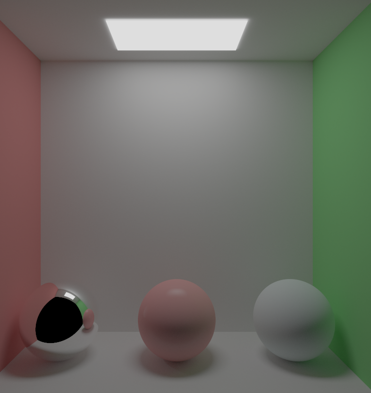

<div align="center">

# Software Path Tracing on GPU - [Web Page](https://aminaliari.github.io/posts/path-tracing)

</div>

<div align="center">

]

</div>


## How to build

1. Install the Vulkan SDK, if you want to run on Vulkan.

2. Open the project with Visual Studio 2022:

```

/Application/Solution - Visual Studio 2022/Project.snl

```
4. Select `Debug` or `Release` as the build target.


## References
- [Ray Tracing in One Weekend](https://raytracing.github.io/books/RayTracingInOneWeekend.html)
- [https://blog.demofox.org/2020/05/25/casual-shadertoy-path-tracing-1-basic-camera-diffuse-emissive/](https://blog.demofox.org/2020/05/25/casual-shadertoy-path-tracing-1-basic-camera-diffuse-emissive/)
- [https://www.youtube.com/watch?v=Qz0KTGYJtUk&ab_channel=SebastianLague](https://www.youtube.com/watch?v=Qz0KTGYJtUk&ab_channel=SebastianLague)
- *A Framework for the Experimental Comparison of Solar and Skydive Illumination*, Joseph T. Kider Jr et al., Cornell University 2014.
- [https://www.scratchapixel.com/lessons/procedural-generation-virtual-worlds/simulating-sky/simulating-colors-of-the-sky.html](https://www.scratchapixel.com/lessons/procedural-generation-virtual-worlds/simulating-sky/simulating-colors-of-the-sky.html)
- [The Forge](https://github.com/ConfettiFX/The-Forge)
  

## License

The project's license is MIT. However, The Forge middleware uses Apache 2.0.